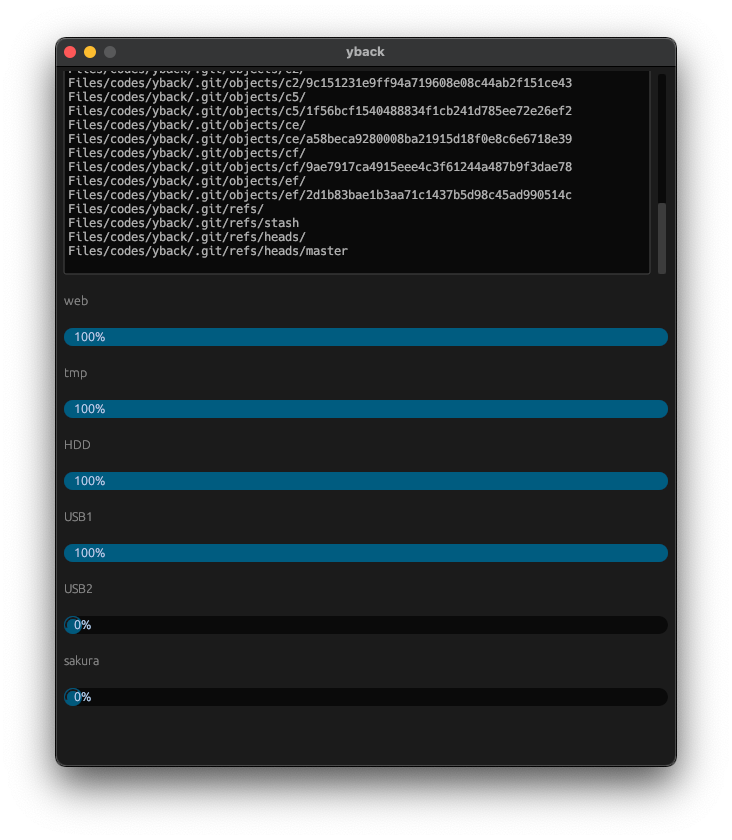

# yback_gui, a GUI-based backup tool written in Rust

## 1. About

`yback_gui` is a GUI-based backup tool wrapping `rsync`.

I rewrote my old [`yback`](https://github.com/your-diary/yback), which is written in C++, in Rust.



## 2. Usage

```bash
cd <package>
cargo run --release -- --help
```

```bash
cd <package>
cargo run --release [-- <option(s)>]
```

## 3. Configuration Files

- `<package>/config.json`

```json
{
    "config_list": [
        {
            "name": "web",
            "from": [
                "/var/www/"
            ],
            "to": "/home/user/web/html/",
            "options": [
                "-ah",
                "--log-file=/home/user/logs/rsync.log",
                "--delete-excluded"
            ]
        },
        ...
    ]
}
```

<!-- vim: set spell: -->
